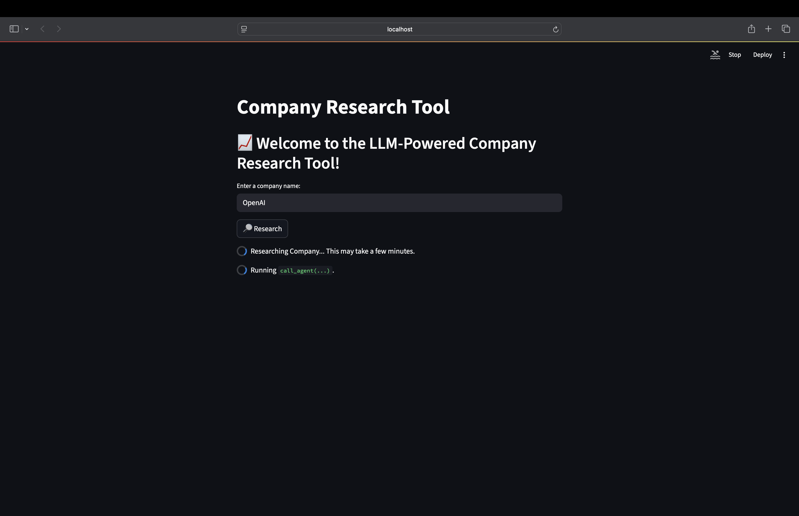

# Company Research Tool

A Streamlit web application that leverages advanced Large Language Models (LLMs) and real-time web search to provide up-to-date, structured research on any company.

## Features
- **LLM-Powered Research**: Uses state-of-the-art LLMs (via OpenRouter and DeepSeek) to generate detailed company profiles.
- **Real-Time Data**: Integrates with TavilySearch to fetch the latest information from the internet.
- **Structured Output**: Automatically gathers and formats:
  1. Official Name
  2. Ticker
  3. Market Segment
  4. CEO
  5. Founder(s)
  6. Market Cap (in USD)
  7. Revenue (in USD)
  8. Short History
  9. Fun Facts
- **Simple UI**: Clean Streamlit interface for easy company lookup.
- **Caching**: Results are cached for efficiency.

## Demo




## Getting Started

### Prerequisites
- Python 3.11+
- API keys for [DeepSeek](https://openrouter.ai) and [Tavily](https://tavily.com/)

### Installation
1. **Clone the repository:**
   ```bash
   git clone https://github.com/Mihai-07/Company-Research-Tool
   cd CompanyResearchTool
   ```
2. **Install dependencies:**
   ```bash
   pip install -r requirements.txt
   # or, if using uv/pyproject.toml:
   uv pip install -r pyproject.toml
   ```

### Configuration
Create a `.streamlit/secrets.toml` file with your API keys:
```toml
[api_keys]
deepseek = "YOUR_DEEPSEEK_API_KEY"
tavily = "YOUR_TAVILY_API_KEY"
```

### Running the App
```bash
streamlit run Home.py
```

## Usage
1. Enter a company name in the input box.
2. Click the **Research** button.
3. View the structured, up-to-date company profile generated by the AI.

> **Note:** The information is AI-generated and may not always be accurate. Always verify critical details from official sources.

## Project Structure
```
CompanyResearchTool/
├── agent/
│   ├── agent.py        # Agent logic and prompt
│   └── tools.py        # Internet search tool
│
├── pages/
│   └── About.py        # The About Page
│
├── Demo.py             # Streamlit web app
├── pyproject.toml      # Project dependencies (.toml file)
├── requirements.txt    # Project dependencies (.txt file)
├── README.md           # This file
└── ...
```

## Dependencies
- [Streamlit](https://streamlit.io/)
- [LangChain](https://python.langchain.com/)
- [langchain-openai](https://github.com/langchain-ai/langchain)
- [langchain-tavily](https://github.com/langchain-ai/langchain)

### Accessing the App via the Internet
To safely access the app online, click [CompanyResearchTool](https://mihai-07-companyresearch.streamlit.app)

## License
MIT License. See [LICENSE](LICENSE) for details.

## Disclaimer
This tool is for informational purposes only. The responses are generated by AI and may contain inaccuracies. Use at your own risk.